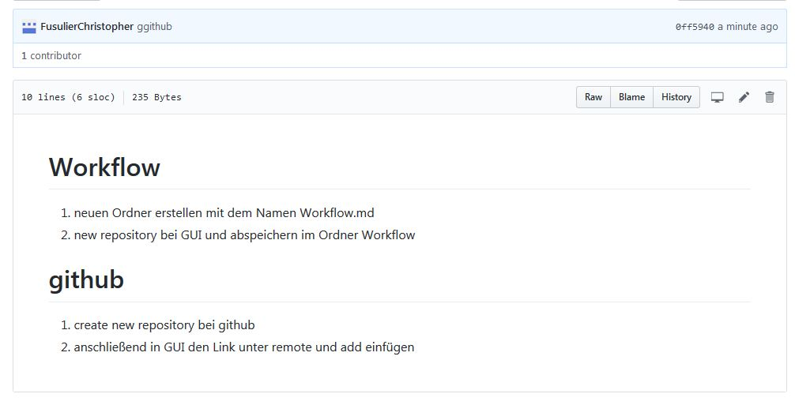

# Workflow

1. neuen Ordner erstellen mit dem Namen Workflow.md
1. new repository bei GUI und abspeichern im Ordner Workflow

# github
1. create new repository bei github
1. anschließend in GUI den Link unter remote und add einfügen

# Bild und Link

